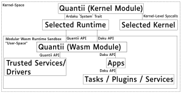

# Design

## High-Level Architecture Design
This diagram shows a high-level representation of the interactions between
different modules running on Quantii.

Note that in order to be as portable as possible to as many platforms, Quantii
can switch out components via feature flags:

The kernel can be switched out to be either:
 - Novusk (Linux-inspired microkernel)
 - Neutron (Minimalist kernel)

The WebAssembly runtime can be switched out to be either:
 - Wari (Ahead-of-time Compiled)
 - Wasmi (Interpreted - Mostly for testing)

Note: Runtimes currently need to compile to no-std to run on Quantii.

